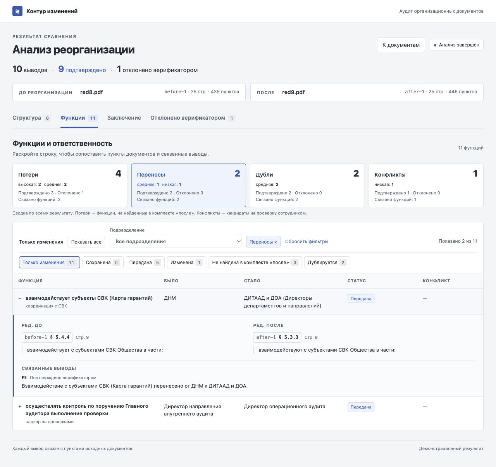
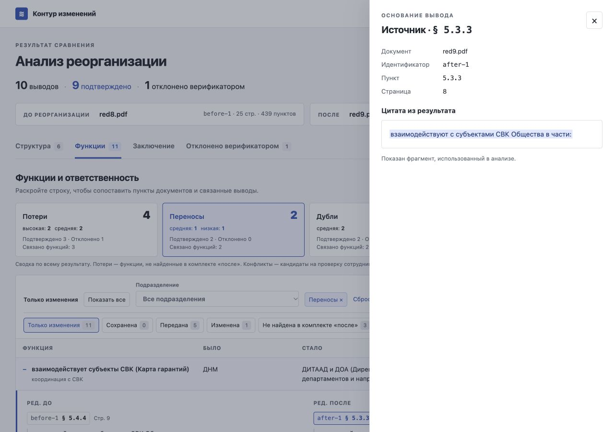
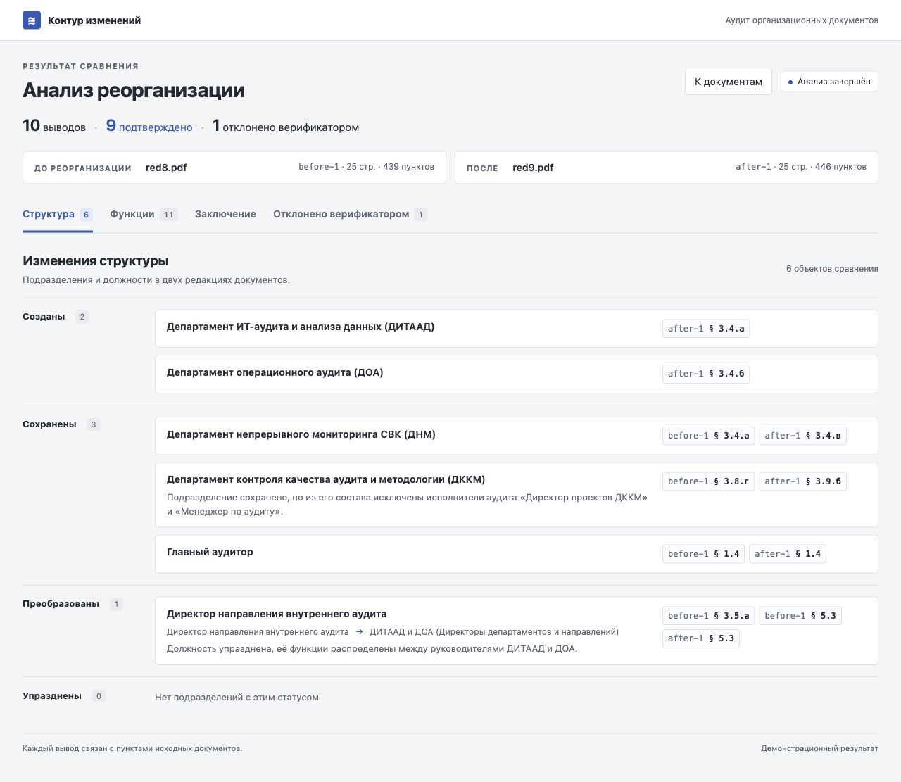

# Контур изменений

«Контур изменений» сравнивает комплекты организационных документов до и после реорганизации и выявляет изменения подразделений, переносы функций, дублирование и кандидатов на проверку конфликта интересов.
Каждый вывод связан с пунктами исходных документов, а цитаты проверяет программный верификатор.
В демонстрационных сэмплах `red8.pdf` и `red9.pdf` разобраны соответственно **439 и 446 пунктов**, по **25 страниц** в каждом документе.

Проект команды **Token burner** для HackAlem AI. Черновик документации; интеграция API и Docker ещё уточняется.

## Скриншоты

Кадры фиксированного мока, ширина интерфейса — 1280 px.

**Функции:** фильтр «Переносы» и раскрытое сопоставление редакций со связанным выводом.



**Источник:** документ, номер пункта, страница и подсвеченная цитата из результата.



**Структура:** подразделения и должности сгруппированы по статусам, у каждого есть ссылки на пункты.



[Питч — 4 слайда в HTML](docs/pitch/index.html): открыть в браузере, листать стрелками; кнопка «Печать / PDF» печатает все четыре слайда. На втором слайде оставлено место для живого демо.

## Быстрый старт

Два альтернативных способа запуска из корня репозитория; выберите один:

```bash
docker compose up --build
uvicorn backend.main:app --reload --port 8000
```

Для запуска без Docker нужны Python 3.12, установленные зависимости из [requirements.txt](requirements.txt) и `OPENAI_API_KEY` в окружении или локальном `.env` для вызовов моделей. Настройки моделей задаются через `MODEL_EXTRACT`, `MODEL_MATCH` и `MODEL_REPORT`; `.env` не следует коммитить.

**TODO — запуск после интеграции бэкенда:** команды взяты из [CLAUDE.md](CLAUDE.md), но `backend/main.py`, `Dockerfile` и `docker-compose.yml` пока отсутствуют. После их добавления проверить оба способа запуска и доступность интерфейса по адресу `http://localhost:8000`.

## Архитектура

```mermaid
flowchart LR
    files["PDF / DOCX<br/>Комплекты до и после"] --> ingest["ingest<br/>Текст и пункты"]
    ingest --> extract["extract<br/>Структура и функции"]
    extract --> prematch["prematch<br/>Предварительное сопоставление"]
    prematch --> match["match<br/>Смысловая классификация"]
    match --> verify["verify<br/>Проверка ссылок и цитат"]
    verify --> report["report<br/>Заключение"]
    report --> result["AnalysisResult<br/>JSON"]
    result --> ui["Vue 3<br/>Инструмент аудитора"]
```



| Шаг | Что делает текущая реализация |
| --- | --- |
| `ingest` | Читает текстовый PDF или DOCX, выделяет пункты и подпункты, сохраняет `doc_id`, `clause_id` и страницу; у DOCX страница — `null`. |
| `extract` | Извлекает подразделения, роли и атомарные функции через LLM. Структура обрабатывается по документу целиком, функции — параллельно по группам пунктов с сохранением контекста исполнителя. |
| `prematch` | Нормализует названия исполнителей, сопоставляет неизменённые функции и формирует кандидатов на перенос, изменение и дублирование без LLM. |
| `match` | Классифицирует оставшиеся функции через LLM, проверяет кандидатов в дубли и конфликты, собирает изменения структуры. Модель получает полный текст комплекта «после» для поиска аналогов. |
| `verify` | Проверяет каждую ссылку и цитату, формальные требования к типу находки и пересчитывает счётчики подтверждённых и отклонённых выводов. |
| `report` | Собирает основные разделы заключения по шаблону из подтверждённых находок; модель пишет вводный абзац, при её недоступности используется шаблон. |

Оркестрация находится в [pipeline.py](backend/agent/pipeline.py), модели данных — в [schemas.py](backend/agent/schemas.py). Контракт обмена — [result.schema.json](contracts/result.schema.json), фиксированный демонстрационный результат — [demo_result.json](data/demo_result.json). `trace` хранит шаги, время начала и завершения, а для вызовов моделей — также сведения об использовании токенов.

Фронтенд — один [index.html](frontend/index.html) с CSS внутри и локальной production-сборкой Vue 3: без npm, сборки и CDN. В интерфейсе есть загрузка двух комплектов, прогресс, вкладки «Структура», «Функции», «Заключение» и «Отклонено верификатором»; находки связаны с функциями через `function_ids`.

## Как работает верификатор

[Верификатор](backend/agent/verify.py) написан на Python и не вызывает LLM.

1. Проверяет, что `doc_id` относится к загруженному документу, а `clause_id` существует в нём.
2. Нормализует регистр, `ё`/`е`, пробелы, пунктуацию и переносы слов в PDF. Учитывает текст подпунктов и вводную часть родительского пункта.
3. Для нечёткого совпадения требует одновременно **`rapidfuzz.fuzz.partial_ratio ≥ 85`** и **не более 2 «чужих» слов** — слов цитаты, отсутствующих в проверяемом тексте пункта. Порог 85 используется по умолчанию и задаётся настройкой `QUOTE_MIN_SCORE`; полное точное совпадение принимается отдельно, в том числе для короткого пункта.
4. Проверяет состав доказательств: перенос и изменение требуют ссылок на обе редакции, дублирование — минимум на два разных пункта комплекта «после». Для предполагаемой потери дополнительно ищет цитату в комплекте «после»: найденный аналог опровергает такую находку.
5. При неудаче оставляет находку в результате с `verified=false` и `rejection_reason`. Счётчики в шапке и отдельная вкладка позволяют увидеть, какие выводы отклонены и почему.

Целевое поведение: **отклонённые находки не попадают в заключение** и остаются доступны во вкладке «Отклонено верификатором».

**TODO — согласовать Reporter с этим правилом:** сейчас [report.py](backend/agent/report.py) исключает отклонённые находки из подтверждённых выводов и входа для вводного абзаца, но добавляет их отдельным справочным блоком в `conclusion_md`. До финальной версии нужно убрать этот блок из заключения либо отдельно согласовать формат приложения.

Проверка цитат подтверждает опору на исходный текст, но сама по себе не доказывает правильность смысловой интерпретации. Конфликт интересов остаётся **кандидатом на проверку сотрудником**.

## Демо-сценарий на data/samples

Для воспроизводимого показа используйте [red8.pdf](data/samples/red8.pdf) в комплекте «До реорганизации» и [red9.pdf](data/samples/red9.pdf) в комплекте «После». Рядом лежат текстовые версии для ручной сверки пунктов.

1. Выберите документы и нажмите «Анализировать». Проследите шаги от `ingest` до `report`, затем переход к результатам.
2. Во вкладке «Структура» покажите созданные ДИТААД и ДОА, сохранённые ДНМ и ДККМ и преобразование должности директора направления внутреннего аудита.
3. Во вкладке «Функции» начните с режима «Только изменения». Сопоставьте перенос функции ДНМ из § 5.4.4 в § 5.3.3 новой редакции и раскройте две колонки с цитатами.
4. Покажите функции из § 5.6.2, § 5.6.3 и § 5.7.2 старой редакции, **не найденные в загруженном комплекте «после»**. Затем проверьте дублирование анализа результатов непрерывного аудита в § 5.3.8 и § 5.4.5 новой редакции.
5. Нажмите на evidence-чип: панель источника показывает документ, пункт, страницу и подсвеченную цитату. Во вкладке отклонённых находок откройте причину отказа верификатора.
6. Перейдите в «Заключение», используйте оглавление и кнопку «Скачать», которая открывает печать с возможностью сохранить PDF средствами браузера.

В фиксированном моке — **10 выводов: 9 подтверждено, 1 отклонён**, а в таблице — 11 функций. Эти числа относятся к сохранённому демо и не являются обещанием идентичного результата нового вызова моделей.

**Пока API не готов:** в `frontend/index.html` установите `SIMULATE_API = true` и запустите `python -m http.server` из `frontend/`. Клиент пройдёт шаги с задержкой и загрузит локальную копию `frontend/demo_result.json`; выбранные файлы при этом не анализируются и не отправляются на сервер. По умолчанию флаг выключен. Ссылка «Открыть демо-результат» добавляет `?demo=1`: при выключенной имитации она обращается к `/api/demo`, при включённой — к локальному моку.

Для отдельного запуска текущего пайплайна через CLI после установки Python-зависимостей и настройки доступа к модели:

```bash
python -m backend.cli data/samples/red8.pdf --after data/samples/red9.pdf -o data/jobs/demo_result.json
```

В текущем CLI `--after` обязателен. Команда сохраняет новый результат отдельно от фиксированного мока; она запускает реальный анализ с вызовами моделей.

## API — TODO

Предварительный контракт из [AGENTS.md](AGENTS.md); реализацию и примеры ответов нужно проверить после появления HTTP-бэкенда.

| Метод и путь | Ожидаемое поведение |
| --- | --- |
| `POST /api/analyze` | Multipart: повторяющиеся поля `before[]` и `after[]`; ответ `{job_id}`. |
| `GET /api/jobs/{id}` | `status`: `queued`, `running`, `done` или `error`; поля `step`, `progress`, при завершении — `result`, при ошибке — `error`. |
| `GET /api/clause/{doc_id}/{clause_id}` | Полный текст пункта, страница и соседние пункты: `{text, page, neighbors}`. |
| `GET /api/demo` | Сохранённый `AnalysisResult`. |

Фронтенд опрашивает задание с интервалом 1,5 с после ответа, без наложения запросов; ожидает `progress` в диапазоне 0–1 и использует `trace`, если он передан. Ошибка сети при поллинге позволяет повторить проверку того же задания без повторной загрузки файлов.

**TODO:** согласовать передачу `trace` во время работы, обработку ошибок, лимиты загрузки, `DEMO_MODE=1` и раздачу фронтенда. Синхронизировать текущие модели бэкенда с JSON Schema, моком и UI, включая новый тип находки `change`. Панель источника пока берёт данные из `Evidence`: `USE_CLAUSE_API = false`; после проверки эндпоинта включить флаг, сохранив fallback на цитату.

## Docker — TODO

Добавить и проверить `Dockerfile` и `docker-compose.yml`. План из [AGENTS.md](AGENTS.md): базовый образ `python:3.12-slim`, установка Python-зависимостей, копирование `backend/`, `frontend/` и `data/`, запуск `uvicorn backend.main:app --host 0.0.0.0 --port 8000`. Уточнить переменные окружения, порт и хранение загруженных файлов, заданий и кэша.

## Ограничения

- Поддерживаются PDF с текстовым слоем и DOCX; OCR для сканов отсутствует. Номер страницы у DOCX не определяется.
- Один запуск сравнивает два комплекта; в каждом может быть несколько файлов. При неполной обработке выставляется `analysis_complete=false`, выводятся предупреждения, а находки о потерях не подтверждаются.
- Отсутствие пункта или изменение нумерации не доказывает потерю функции: аналог может находиться у другого исполнителя или быть переформулирован. Результаты требуют проверки аудитором.
- Полнота извлечения и смысловая классификация зависят от модели и качества исходных документов; верификатор не заменяет экспертную оценку.
- В прототипе нет авторизации, базы данных и внешней очереди заданий. Промышленная эксплуатация и сквозная интеграция веб-API ещё не проверены.
- Локальная сборка Vue и мок позволяют показывать интерфейс офлайн; реальный анализ требует доступного сервиса модели. Имитация не оценивает загруженные пользователем файлы.
- Соответствие законодательству и бенчмаркинг с другими организациями пока не анализируются.

## Roadmap

- Проверка соответствия организационных документов законодательству со ссылками на применимые нормы.
- Бенчмаркинг структуры и распределения функций относительно сопоставимых организаций.
- Анализ и согласование должностных инструкций с положениями о подразделениях.
- Проверенный on-prem запуск через `OPENAI_BASE_URL`: настройка альтернативного адреса уже есть, но нужно подтвердить совместимость локального сервера с Responses API и структурированными ответами.
